# AI 용어 정리

* AI(인공지능)

  인간이 가지는 특유의 학습, 추론 능력을 컴퓨터로 구현하려는 가장 포괄적인 개념

* Machine Learning

  AI를 구현하기 위한 하나의 방법. 데이터의 특성과 패턴을 학습 후, 미지의 데이터에 대한 추정치를 계산하는 프로그래밍 기법

* Deep Learning

  ML 중 Neural Network를 사용하는 기법

* Data Mining

  데이터의 상관관계를 분석하여 새로운 feature를 알아내는 방법

# Machine Learning

데이터를 학습해서 미지의 데이터에 대한 prediction

Explicit program(Rule based based programming)으로 해결할 수 없는 문제를 해결하기 위해 등장 => 경우의 수가 너무 많아 Rule 또한 너무 많아 해결 불가능( ex) 바둑 )

학습 방법에 따라 크게 4가지로 구분

* 지도학습(Supervised Learning) => Data Set에 Label 유 

  ​															우리가 해결하는 거의 대부분의 문제

  1. Regression

     훈련 데이터 셋을 이용해 학습하고 나온 predict model이 연속적인 값을 예측(얼마나??)

     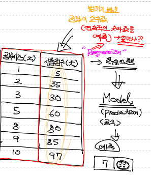

  2. Binary Classification

     predict model이 어떤 부류에 속하는지를 예측(어떤 것??)

     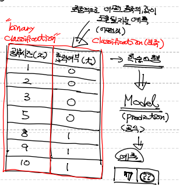

  3. Multinomial Classification

     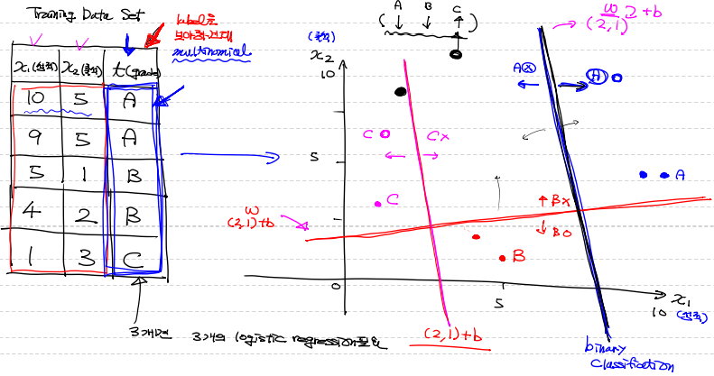

* 비지도학습(Unsupervised Learning) => Data Set에 Label 무 

* 준지도학습(Semi-supervised Learning) =>  Data Set에 Label 유무가 혼재 

* 강화학습(Reinforcement Learning) => 별개의 방법


## 수치 미분(Numerical Differentation)

프로그램적으로 계산을 통해 [미분](함수에 대해 특정 순간의 변화량)을 수행(약간의 오차 발생)

보통 중앙차분을 이용

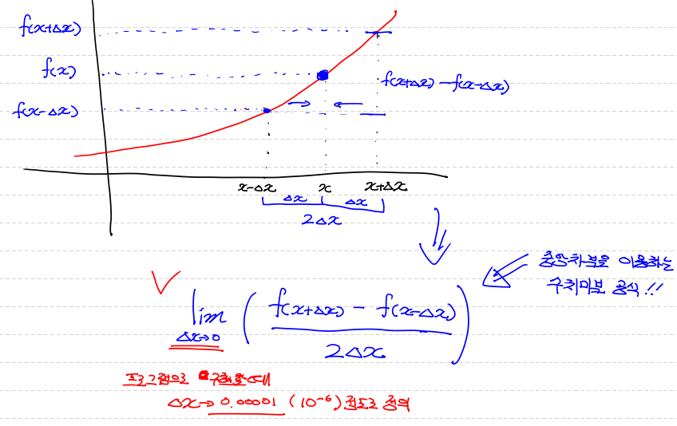

편미분 : 입력변수(독립변수)가 2개 이상인 다변수 함수에서 미분하고자하는 변수를 제외한 나머			   지 변수들을 상수처리해서 미분을 진행

* 일변수 함수에 대한 수치 미분

  ```python
  # 입력으로 들어오는 x에서 아주 미세하게 변화할때
  # 함수 f가 얼마나 변하는지에 대해 수치적으로 계산해보아요!
  
  # 아래의 함수는 인자를 2개 받아요.
  # 한개는 미분하려는 함수, 특정 점에서 미분값을 구하기 위한 x값.
  def numerical_derivative(f,x):
      
      # f : 미분하려는 함수
      # x : 미분값을 알고자하는 입력값.
      # delta_x => 극한에 해당하는 값으로 아주 작은값을 이용.
      #            1e-8이하로 지정하면 소수점 연산 오류가 발생.
      #            일반적으로 1e-5정도로 설정하면 되요
      delta_x = 1e-5
      
      return (f(x+delta_x) - f(x-delta_x)) / (2 * delta_x) # 중앙 차분
      
      
  # 미분하려는 함수가 있어야 해요! (일변수 함수)
  def my_func(x):
      
      return x ** 2     # f(x) = x^2
  
  result = numerical_derivative(my_func,3)
  
  print('미분한 결과값은 : {}'.format(result))  # 6.000000000039306
  ```

* 다변수 함수에 대한 수치 미분

  ```python
  ### 일반적으로 다변수 함수의 수치미분 코드를 이용합니다.
  
  # 입력변수가 2개 이상인 다변수 함수인 경우
  # 입력변수는 서로 독립이기 때문에 수치미분 역시 변수의 개수만큼 개별적으로
  # 진행해야 해요!
  
  import numpy as np
  
  def numerical_derivative(f,x):
      
      # f : 미분하려고 하는 다변수 함수
      # x : 모든 값을 포함하는 numpy array  ex) f'(1.0, 2.0) = (8.0, 15.0)
      delta_x = 1e-4
      derivative_x = np.zeros_like(x)    # [0 0]
      
      it = np.nditer(x, flags=['multi_index'])
      
      while not it.finished:
          
          idx = it.multi_index   # 현재의 iterator의 index를 추출 => tuple형태로 나와요     
          
          tmp = x[idx]     # 현재 index의 값을 잠시 보존.
                           # delta_x를 이용한 값으로 ndarray를 수정한 후 편미분을 계산
                           # 함수값을 계산한 후 원상복구를 해 줘야 다음 독립변수에
                           # 대한 편미분을 정상적으로 수행할 수 있어요!   
          x[idx] = tmp + delta_x        
          fx_plus_delta = f(x)    # f([1.00001, 2.0])   => f(x + delta_x)
          
  
          x[idx] = tmp - delta_x
          fx_minus_delta = f(x)   # f([0.99999, 2.0])   => f(x - delta_x)
          
          derivative_x[idx] = (fx_plus_delta - fx_minus_delta) / (2 * delta_x)
          
          x[idx] = tmp
          
          it.iternext()
          
      return derivative_x
  
  
  def my_func(input_data):
      
      x = input_data[0]
      y = input_data[1]
      return 2*x + 3*x*y + np.power(y,3)     # f(x) = 2x + 3xy + y^3
  
  
  param = np.array([1.0,2.0])
  result = numerical_derivative(my_func,param)
  print('미분한 결과는 : {}'.format(result)) # [8, 15.0000001]
  ```


## Tensorflow

```python
# Tensorflow는 1.x버전과 2.x버전으로 나뉘어져요!
# 1.x버전은 low level의 코딩이 필요!
# 2.x버전은 상위 API(Keras)가 기본으로 포함. => 구현이 쉬워요!

import tensorflow as tf
print(tf.__version__) # 1.15.0

node1 = tf.constant('Hello World')

# 그래프를 실행하려면 1.x버전에서는 session이 필요
# 1.x버전에서만 사용되요. 2.x버전에서는 삭제
# session은 그래프안의 특정 노드를 실행시킬 수 있어요!
sess = tf.Session()

print(sess.run(node1).decode()) # Hello World

print(node1)  # Tensor("Const:0", shape=(), dtype=string)

node1 = tf.constant(10, dtype=tf.float32)
node2 = tf.constant(30, dtype=tf.float32)

node3 = node1 + node2

print(sess.run([node3, node1])) # [40.0, 10.0]
```


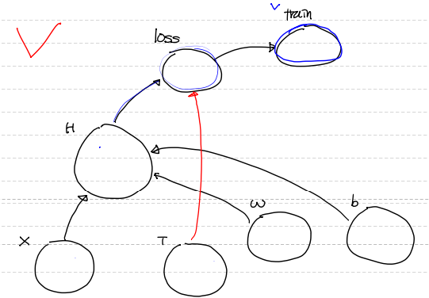

```python
  import numpy as np
  import pandas as pd
  import tensorflow as tf
  
  # 1. training data set
  x_data = (np.array([1,2,3,4,5])).reshape(5,1)   # 공부시간 
  t_data = (np.array([3,5,7,9,11])).reshape(5,1)  # 시험성적
    
  # 2. placeholder => 데이터는 아직. 모형만
  X = tf.placeholder(shape=[None,1], dtype=tf.float32)
  T = tf.placeholder(shape=[None,1], dtype=tf.float32)
  
  # 3. Weight & bias   
  W = tf.Variable(tf.random.normal([1,1]), name='weight')
  b = tf.Variable(tf.random.normal([1]), name='bias')
  
  # 4. Hypothesis or predict model
  H = tf.matmul(X,W) + b   # y = Wx + b => 2차원행렬로 처리 
    					   # => y = X dot W + b
  
  # 5. W,b를 구하기 위해 평균제곱오차를 이용한 최소제곱법을 통해
  #    loss function을 정의
  loss = tf.reduce_mean(tf.square(H - T))
  
  # 6. train
  train = tf.train.GradientDescentOptimizer(learning_rate=1e-3).minimize(loss)
  
  # 7. session & 초기화
  sess = tf.Session()
  sess.run(tf.global_variables_initializer())   # 초기화 (2.x 넘어오면서 삭제)
  
  # 8. 학습을 진행
  # 반복학습을 진행 ( 1 epoch : training data set 전체를 이용하여 1번 학습)
  for step in range(30000):
      
      _, W_val, b_val, loss_val = sess.run([train,W,b,loss], 
                                           feed_dict={X : x_data, T : t_data})
      
      if step % 3000 == 0:
          print('W : {}, b : {}, loss : {}'.format(W_val, b_val, loss_val))
          
  # 9. 학습이 종료된 후 최적의 W와 b가 계산되고 이를 이용한 model이 완성
  #    prediction(예측)
  result = sess.run(H, feed_dict={X : [[9]]})
  print('예측값은 : {}'.format(result)) # 예측값은 : [[18.999674]]
```


## 데이터 전처리

머신러닝에서 학습이 잘 되기 위해서는 **양질의 데이터**가 필요 => **데이터 전처리**

1. **이상치 처리**

   이상치(outlier) : 관측된 값이 일반적인 값에 비해 편차가 큰 값을 지칭

   독립변수(feature)에 있는 이상치 => 지대점

   종속변수(label)에 있는 이상치 => 이상치

   이상치 검출 & 처리 방법

   1. Tukey Fences

      Box plot의 사분위를 이용해서 이상치를 graph에서 확인

      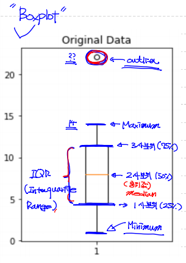

      IQR value : 3사분위값 - 1사분위값

      이상치 : 1사분위값 - (IQR Value * 1.5) 미만의 값들

      ​			   3사분위값 + (IQR Value * 1.5) 초과의 값들

      ​			  이 경계들을 Tukey Fences라 부른다.

      ```python
      import numpy as np
      import matplotlib.pyplot as plt
      
      data = np.array([1,2,3,4,5,6,7,8,9,10,11,12,13,14,22.1])
      
      fig = plt.figure()   # 새로운 figure를 생성
      fig_1 = fig.add_subplot(1,2,1)
      fig_2 = fig.add_subplot(1,2,2)
      
      fig_1.set_title('Original Data')
      fig_1.boxplot(data)
      
      # numpy를 이용해서 사분위수를 구해보아요! percentile()
      print(np.median(data))         # 중위값(2사분위) => 8.0
      print(np.percentile(data,25))  # 1사분위 => 4.5
      print(np.percentile(data,50))  # 2사분위 => 8.0
      print(np.percentile(data,75))  # 3사분위 => 11.5
      
      # IQR value
      iqr_value = np.percentile(data,75) - np.percentile(data,25)
      print(iqr_value)  # 7.0
      
      upper_fense = np.percentile(data,75) + (iqr_value * 1.5)
      lower_fense = np.percentile(data,25) - (iqr_value * 1.5)
      
      print(upper_fense)  # 22.0
      print(lower_fense)  # -6.0
      
      ## 이상치를 출력해보아요!!
      print(data[(data > upper_fense) | (data < lower_fense)])  # [22.1]
      
      result = data[(data <= upper_fense) & (data >= lower_fense)]
      
      fig_2.set_title('Remove Outlier')
      fig_2.boxplot(result)
      
      fig.tight_layout()
      plt.show()
      ```

      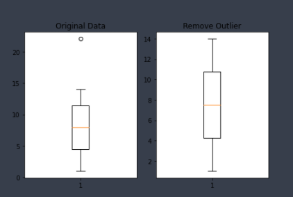

      

      

   2. Z-score

      정규분포와 표준편차를 이용해서 이상치를 확인

      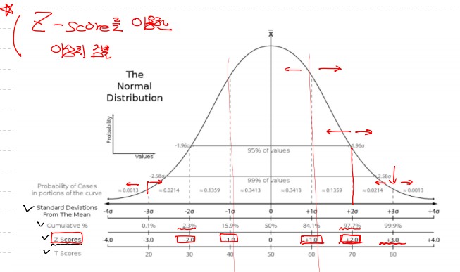

      ```python
      import numpy as np
      from scipy import stats
      
      zscore_threshold = 1.8 # (2.0이 optimal value) => 상위 95% 이상, 하위 95% 이하인 값
      
      data = np.array([1,2,3,4,5,6,7,8,9,10,11,12,13,14,22.1])
      
      # outlier 출력
      outlier = data[np.abs(stats.zscore(data)) > zscore_threshold]
      
      # 이상치를 제거한 데이터
      data[np.isin(data,outlier, invert=True)]
      

      # 또 다른 방법
      for col in data.columns:
          tmp = ~(np.abs(stats.zscore(data[col])) > zscore_threshold)
          data = data.loc[tmp]
      ```
      
      

2. **정규화(Normalization)**

   비율을 이용해서 data의 scale을 조정

   1. Min-Max 정규화

      data의 scale을 최소값 0 ~ 최대값 1 사이로 조정

      이상치에 상당히 민감한 방식이기 때문에 이상치 처리를 미리 해야 한다.

      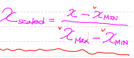

      

   2. Z-score 정규화(Strandardization)

      data의 scale을 평균과 표준편차를 이용해 조정

      이상치에 크게 영향을 받지 않지만, 동일한 scale을 적용할 수 없다.

      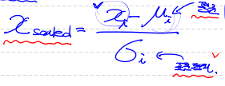
      
      
   
3. 데이터 split

   train 데이터와 validation 데이터로 최적 epoch 수를 결정

   데이터가 적을 경우 k-fold cross validation을 진행

   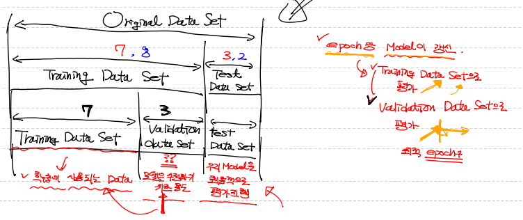

   
   
4. 결측치 처리

   1. Deletion(결측치 제거)

      결측치가 독립 변수인지 종속 변수인지, 전체 데이터에서 비중이 얼마나 되는가 고민

      * Listwise 삭제방식

        NaN이 존재하면 행 자체를 삭제

        손쉽게 접근 가능하지만 다른 의미 있는 데이터도 삭제되는 것이 문제

        데이터가 충분히 많고 NaN의 빈도가 상대적으로 적을 경우 최상의 방법

      * Pairwise 삭제방식

        NaN이 존재해도 행 자체를 삭제하지 않고 그 값만 모든 처리에서 제외

        오히려 문제가 발생할 여지가 있음

   2. Imputation(결측치 보간)

      * 평균화 기법

        평균(mean), 중앙값(median), 최빈값(mode)을 NaN에 삽입

        쉽고 빠르지만, 통계 분석에 영향을 미친다.

      * 예측 기법

        결측치들이 완전히 무작위적으로 관측되지 않았다는 것을 가정 => 종속변수

        KNN 등을 이용해서 진행

        일반적으로 평균화 기법보다는 조금 더 나은 결측치 보간 가능

        
   
5. 예시

   ```python
   # 1. 독립변수에 대한 결측치를 검출한 후 Imputation을 진행(평균화기법-median)
   #    median으로 처리하는 이유는 이상치를 처리하지 않았기 때문.
   for col in x_data.columns:
       col_median = np.nanmedian(x_data[col])
       x_data[col].loc[x_data[col].isnull()] = col_median
       
   # 2. 독립변수에 대한 이상치를 검출한 후 mean값으로 처리
   zscore_threshold = 1.8   # z-score outlier 임계값으로 사용
   
   for col in x_data.columns:
       outlier = x_data[col][(np.abs(stats.zscore(x_data[col])) > zscore_threshold)]
       col_mean = np.mean(x_data.loc[~x_data[col].isin(outlier),col])
       x_data.loc[x_data[col].isin(outlier),col] = col_mean
       
   # 3. 종속변수에 대한 이상치를 검출 한 후 mean값으로 처리할께요!     
   outlier = t_data[(np.abs(stats.zscore(t_data)) > zscore_threshold)]
   col_mean = np.mean(t_data[~t_data.isin(outlier)])
   t_data[t_data.isin(outlier)] = col_mean
   
   # 4. 정규화
   scaler_x = MinMaxScaler()
   scaler_t = MinMaxScaler()
   
   scaler_x.fit(x_data.values)
   scaler_t.fit(t_data.values.reshape(-1,1))
   
   x_data_norm = scaler_x.transform(x_data.values)
   t_data_norm = scaler_t.transform(t_data.values.reshape(-1,1)).ravel()
   
   # 5. 종속변수에 대한 결측치를 KNN을 이용하여 Imputation 처리
   # NaN이 있으면 학습하지 못하므로 종속변수의 결측치를 제거
   x_data_train_norm = x_data_norm[~np.isnan(t_data_norm)]
   t_data_train_norm = t_data_norm[~np.isnan(t_data_norm)]
   
   knn_regressor = KNeighborsRegressor(n_neighbors=2)
   knn_regressor.fit(x_data_train_norm,t_data_train_norm)
   
   # 종속변수의 결측치를 KNN의 예측값으로 채워줌
   knn_predict = knn_regressor.predict(x_data_norm[np.isnan(t_data_norm)])
   t_data_norm[np.isnan(t_data_norm)] = knn_predict
   ```

   

## Learning Rate

W와 b를 갱신할 때 사용되는 customizin 상수로 데이터에 따라 적절히 조정

* 필요 이상으로 크게 설정 => Overshooting

  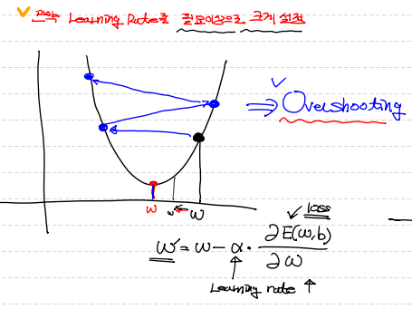

* 필요 이상으로 작게 설정 => local minimal

  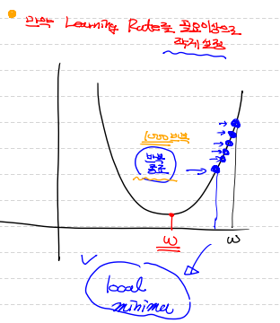


## 과대적합/과소적합

데이터를 이용해 학습이 끝난 후 우리 model의 상태를 지칭하는 용어

* 과대적합(Overfitting)

  Model이 train 데이터에 너무 적합해서 다른 데이터에는 잘 예측하지 못한다.

  해결방법 => 적절한 epoch 수, 많은 데이터 양, feature의 개수를 줄인다.

  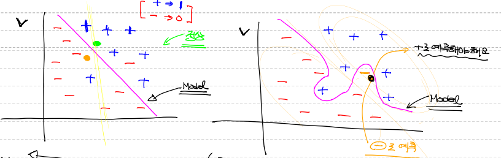

* 과소적합(Underfitting)

  Model이 충분한 학습을 하지 못해 Model 자체가 비완성


## 성능 평가

train 데이터로 성능 평가하지 않는다.

Confusion Matrix : 분류 model이 잘 만들어진 모델인지 확인하기 위한 기준

1. Pression(정밀도) : True로 예측한 것 중 실제 True인 것의 비율

   = TP/(TP+FP)

2. Recall(재현율) : 실제 True 중에 True로 예측한 것의 비율

   = TP/(TP+FN)

3. Acurracy(정확도) : True을 True로, False를 False로 예측한 것의 비율

   = TP+FN/(TP+FN+FP+TN)

   domain의 bias를 반드시 고려해야 한다

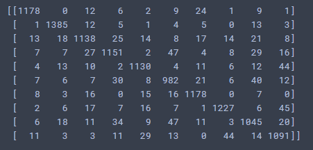

​		이런 식으로 어떤 것을 다른 특정한 것으로 착각했다던지를 파악할 수 있다.


## Regression

Regression Model(회귀 모델)은 어떠한 데이터에 대해서 그 값에 영향을 주는 조건을 고려하여 데이터의 평균을 구하기 위한 함수. 즉, 그 데이터를 가장 잘 표현하는 함수.

* Model을 만드는 이유?

  우리가 해결해야 하는 현실은 너무 복잡 => 단순화. 따라서, 가정이 필요

  * 오차항은 정규분포를 따른다.

  * 독립변수와 종속변수가 선형관계

  * 데이터에 이상치가 없다.

  * 독립변수와 오차항은 독립 등등

    
### Simple Linear Regression

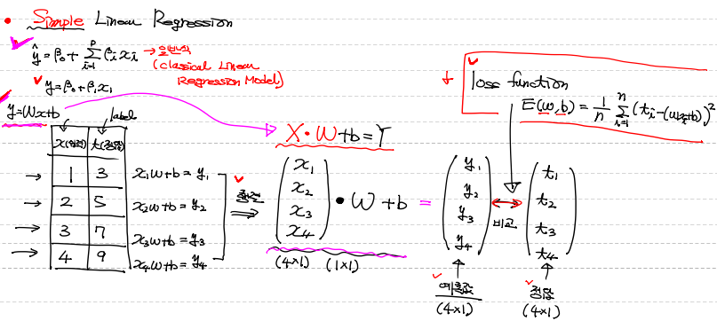

* MSE

  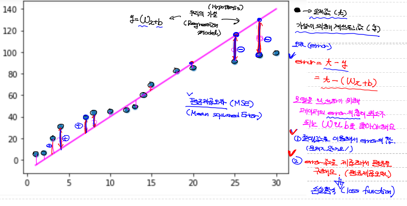

  

* 손실 함수(Loss Function) = 비용 함수(Cost Function)

  훈련 데이터 셋의 정답 t와 입력 x에 대한 y(모델의 예측값)의 차이를 모두 더해 수식으로 나타낸 식 => MSE를 이용

  최소제곱법을 이용해서 loss function을 만들고 그 값이 최소가 되게 하는 w와 b를 학습 과정을 통해 찾는다.

  

  

* 경사하강법(Gradient Descent Algorithm)

  loss function의 값이 최소가 되게 하는 w를 찾기 위한 방법으로,  loss function의 미분값이 0이 되는 w를 찾기 위해 w를 조금씩 줄여가면서 찾는다.

  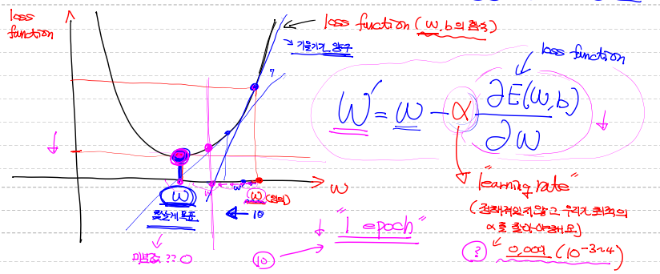

  여기서, epoch와 learning late를 통해 접근을 조절

1. data 전처리

   ```python
     import numpy as np
     import pandas as pd
     from sklearn.preprocessing import MinMaxScaler
     from scipy import stats
     
     # 1. csv 파일 로딩
     df = pd.read_csv('./ozone.csv')
     train_data = df[['Temp','Ozone']]
     
     # 2. 결측치 제거
     train_data = train_data.dropna(how='any')
     
     # 3. 이상치 제거
     zscore_threshold = 1.8
     
     for col in train_data.columns:
         tmp = ~(np.abs(stats.zscore(train_data[col])) > zscore_threshold)
         train_data = train_data.loc[tmp]
     
     x_data = train_data['Temp'].values.reshape(-1,1)
     t_data = train_data['Ozone'].values.reshape(-1,1)
     
     # 4. 정규화
     scaler_x = MinMaxScaler()  # 객체 생성
     scaler_t = MinMaxScaler()  # 객체 생성
     
     scaler_x.fit(x_data)
     scaler_t.fit(t_data)
   
     scaled_x_data = scaler_x.transform(x_data)
     scaled_t_data = scaler_t.transform(t_data)
   ```

   

2. Tensorflow를 이용해서 Simple Linear Regression을 구현

   ```python
     import tensorflow as tf  
         
     # 1. placeholder => 데이터는 아직. 모형만
     X = tf.placeholder(shape=[None,1], dtype=tf.float32)
     T = tf.placeholder(shape=[None,1], dtype=tf.float32)
       
     # 2. Weight & bias   
     W = tf.Variable(tf.random.normal([1,1]), name='weight')
     b = tf.Variable(tf.random.normal([1]), name='bias')
       
     # 3. Hypothesis or predict model
     H = tf.matmul(X,W) + b
       
     # 4.loss function
     loss = tf.reduce_mean(tf.square(H - T))
       
     # 5. train
     train = tf.train.GradientDescentOptimizer(learning_rate=1e-3).minimize(loss)
       
     # 6. session & 초기화
     sess = tf.Session()
     sess.run(tf.global_variables_initializer())
       
     # 7. 학습을 진행
     for step in range(600000):
         
         _, W_val, b_val, loss_val = sess.run([train, W, b, loss], 
                                              feed_dict={X: scaled_x_data, T: scaled_t_data})
         if step % 30000 == 0:
             print('W : {}, b : {}, loss : {}'.format(W_val, b_val, loss_val))
               
     # 8. 예측
     predict_data = np.array([[80]])
     scaled_predict_data = scaler_x.transform(predict_data)
     print("tensorflow 예측 결과 : {}".format(scaler_t.inverse_transform(sess.run(H, feed_dict={X: scaled_predict_data})))) # tensorflow 예측 결과 : [[42.08464]]
     
   ```

   

3. python을 이용해서 Simple Linear Regression을 구현

   ```python
     # 1. Weight & bias
     W1 = np.random.rand(1,1)   
     b1 = np.random.rand(1)
     
     # 2. Hypothesis
     def predict(x):
         
         y = np.dot(x,W1) + b1   
         
         return y
     
     # 3. loss_function
     def loss_func(input_obj):
         
         input_W = input_obj[0]
         input_b = input_obj[1]
         
         y = np.dot(scaled_x_data,input_W) + input_b
         
         return np.mean(np.power((scaled_t_data - y),2))
     
     # 4. 편미분을 위한 함수
     def numerical_derivative(f,x):
         
         delta_x = 1e-4
         derivative_x = np.zeros_like(x)    # [0 0]
         
         it = np.nditer(x, flags=['multi_index'])
         
         while not it.finished:
             
             idx = it.multi_index        
             tmp = x[idx] 
             x[idx] = tmp + delta_x        
             fx_plus_delta = f(x)    # f([1.00001, 2.0])   => f(x + delta_x)
             
             x[idx] = tmp - delta_x
             fx_minus_delta = f(x)   # f([0.99999, 2.0])   => f(x - delta_x)
             
             derivative_x[idx] = (fx_plus_delta - fx_minus_delta) / (2 * delta_x)
             
             x[idx] = tmp
             
             it.iternext()
             
         return derivative_x
     
     # learning rate 설정
     learning_rate = 1e-4
     
     # 5. 학습을 진행
     for step in range(600000):
         input_param = np.concatenate((W1.ravel(), b1.ravel()), axis=0)  
         
         derivative_result = learning_rate * numerical_derivative(loss_func,input_param)
         
         W1 = W1 - derivative_result[:1].reshape(1,1)  # W 갱신
         b1 = b1 - derivative_result[1:]               # b 갱신
     
         if step % 30000 == 0:
             print('W : {}, b : {}'.format(W1,b1))
             
     # 6. 예측
     predict_data = np.array([[80]])
     scaled_predict_data = scaler_x.transform(predict_data)
     print("python 예측 결과 : {}".format(scaler_t.inverse_transform(predict(scaled_predict_data))))
     # python 예측 결과 : [[42.06771086]]
   ```

   

4. sklearn를 이용해서 Simple Linear Regression을 구현

   sklearn은 자동으로 data를 정규화하기 때문에 사전에 이상치 제거만 하면 된다.

   ```python
     from sklearn import linear_model
     
     # 1. linear regression model 생성
     model = linear_model.LinearRegression()
     
   # 2. 학습진행
     model.fit(x_data, t_data)
   
     # 3. Weight, bias 확인
   print('W : {}, b : {}'.format(model.coef_, model.intercept_))
     
     # 4. 예측
     predict_data = np.array([[80]])
     print("sklearn 예측 결과 : {}".format(model.predict(predict_data)))
     # sklearn 예측 결과 : [[42.07085704]]
   ```


### Multiple Linear Regression

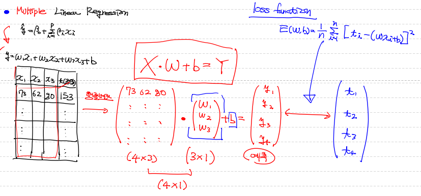


1. data 전처리

```python
# Multiple Linear Regression
import numpy as np
import pandas as pd
import matplotlib.pyplot as plt
import tensorflow as tf
from sklearn import linear_model
from sklearn.preprocessing import MinMaxScaler
from scipy import stats

df = pd.read_csv('./ozone.csv')

# 학습에 필요한 데이터부터 추출
train_data = df[['Temp','Wind','Solar.R','Ozone']]

# 결측치 처리
train_data = train_data.dropna(how='any')

# 이상치 처리
zscore_threshold = 1.8

for col in train_data.columns:
    tmp = ~(np.abs(stats.zscore(train_data[col])) > zscore_threshold)
    train_data = train_data.loc[tmp]
    
x_data = train_data[['Temp','Solar.R','Wind']].values
t_data = train_data['Ozone'].values.reshape(-1,1)

# 정규화 처리
scaler_x = MinMaxScaler()  # 객체 생성
scaler_t = MinMaxScaler()  # 객체 생성

scaler_x.fit(train_data[['Temp','Solar.R','Wind']].values)
scaler_t.fit(train_data['Ozone'].values.reshape(-1,1))

scaled_x_data = scaler_x.transform(train_data[['Temp','Solar.R','Wind']].values)
scaled_t_data = scaler_t.transform(train_data['Ozone'].values.reshape(-1,1))
```


2. tensorflow을 이용해서 Multiple Linear Regression을 구현

```python
X = tf.placeholder(shape=[None,3], dtype=tf.float32)
T = tf.placeholder(shape=[None,1], dtype=tf.float32)

W = tf.Variable(tf.random.normal([3,1]), name='weight')
b = tf.Variable(tf.random.normal([1]), name='bias')

H = tf.matmul(X,W) + b

loss = tf.reduce_mean(tf.square(H - T))

train = tf.train.GradientDescentOptimizer(learning_rate=1e-4).minimize(loss)

sess = tf.Session()
sess.run(tf.global_variables_initializer())

for step in range(600000):
    
    _, W_val, b_val, loss_val = sess.run([train, W, b, loss], 
                                         feed_dict={X: scaled_x_data, T: scaled_t_data})
    if step % 30000 == 0:
        print('W : {}, b : {}, loss : {}'.format(W_val, b_val, loss_val))

predict_data = np.array([[80.0, 150.0, 10.0]])
scaled_predict_data = scaler_x.transform(predict_data)

print("tensorflow 예측 결과 : {}".format(scaler_t.inverse_transform(sess.run(H, feed_dict={X: scaled_predict_data}))))
# tensorflow 예측 결과 : [[38.7607]]

```


3. sklearn을 이용해서 Multiple Linear Regression을 구현

   sklearn은 자동으로 data를 정규화하기 때문에 사전에 이상치 제거만 하면 된다.

```python
model2 = linear_model.LinearRegression()

model2.fit(x_data,t_data)

print('W: {}, b: {}'.format(model2.coef_, model2.intercept_))

print("sklearn 예측 결과 : {}".format(model2.predict(predict_data)))
# sklearn 예측 결과 : [[38.8035437]]
```


## Classification

Train Data Set의 특징과 분포를 이용하여 학습한 후 미지의 데이터에 대해서 결과가 어떤 종류의 값으로 분류될 수 있는지 예측하는 작업


### Binary Classification

0, 1 중에 어떤 값으로 분류되는지 예측

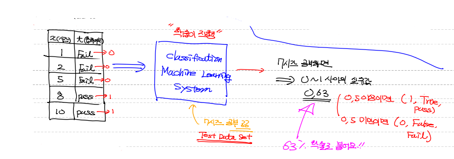

* Logistic Regression

  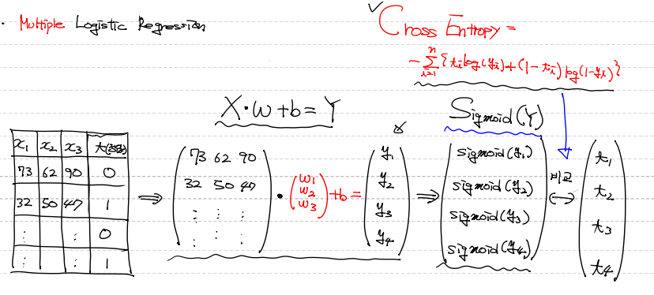

  Linear Regression의 출력(model) wx+b가 어떠한 값을 가지더라도 출력함수로 sigmoid 함수를 이용하면 0~1 사이의 실수값이 도출

  이 때, loss function으로 기존 값(wx+b)에 sigmoid를 취한 형태는 convex 형태가 아닐수도 있어 local minimum을 도출할 가능성이 있다 => Cross Entropy Loss라는 loss function 이용

  

  1. 데이터 전처리

     ```python
     import numpy as np
     import pandas as pd
     import matplotlib.pyplot as plt
     import tensorflow as tf
     from sklearn import linear_model
     from sklearn.preprocessing import MinMaxScaler
     from scipy import stats
     
     # 1. csv 파일 로딩
     df = pd.read_csv('./admission.csv')
     train_data = df[['gre','gpa','rank','admit']]
     
     # 2. 결측치 제거
     train_data = train_data.dropna(how='any')
     
     # 3. 이상치 제거
     zscore_threshold = 2.0
     
     for col in train_data.columns:
         tmp = ~(np.abs(stats.zscore(train_data[col])) > zscore_threshold)
         train_data = train_data.loc[tmp]
     
     x_data = train_data[['gre','gpa','rank']].values
     t_data = train_data['admit'].values.reshape(-1,1)
     
     # 4. 정규화 처리
     # t는 이미 0,1의 값이므로 정규화가 필요 없다.
     scaler_x = MinMaxScaler()
     
     scaler_x.fit(train_data[['gre','gpa','rank']].values)
     
     scaled_x_data = scaler_x.transform(train_data[['gre','gpa','rank']].values)
     
     # 예측 값
     predict_data = np.array([[600.0, 3.8, 1.0]])
     scaled_predict_data = scaler_x.transform(predict_data)
     ```
     
     
     
  2. python를 이용해서 Logistic Regression을 구현

     ```python
     # python 구현
     
     # Weight & bias
     W = np.random.rand(3,1)  # 행렬곱 연산을 위해 matrix형태로 생성
     b = np.random.rand(1)
     
     # 수치미분함수(for python)
     def numerical_derivative(f,x):
     
         delta_x = 1e-4
         derivative_x = np.zeros_like(x)    
         
         it = np.nditer(x, flags=['multi_index'])
         
         while not it.finished:
             
             idx = it.multi_index   # 현재의 iterator의 index를 추출 => tuple형태로 나와요
             
             tmp = x[idx]     
             x[idx] = tmp + delta_x        
             fx_plus_delta = f(x)    # f([1.00001, 2.0])   => f(x + delta_x)
             
     
             x[idx] = tmp - delta_x
             fx_minus_delta = f(x)    # f([0.99999, 2.0])   => f(x - delta_x)
             
             derivative_x[idx] = (fx_plus_delta - fx_minus_delta) / (2 * delta_x)
             
             x[idx] = tmp
             
             it.iternext()
             
         return derivative_x
     
     # loss function
     def loss_func(input_obj): # input_obj [w1 w2 w3 b]
         
         input_W = input_obj[:-1].reshape(-1, 1) # w3까지 3행 1열로
         input_b = input_obj[-1:]
         
         # linear regression의 hypothesis
         z = np.dot(scaled_x_data,input_W) + input_b  # Wx + b
         # logistic regression의 hypothesis
         y = 1 / (1 + np.exp(-1 * z)) 
         
         delta = 1e-7  # log연산시 무한대로 발산하는것을 방지하기 위한 수치처리방식
         
         # coss entropy
         return -np.sum(t_data*np.log(y+delta) + (1-t_data)*np.log(1-y+delta))
     
     # learning rate
     learning_rate = 1e-4
     
     # 학습(Gradient Descent Algorithm을 수행)
     for step in range(100000):
         input_param = np.concatenate((W.ravel(), b.ravel()), axis=0)  # [w1 w2 w3 b]
         derivative_result = learning_rate * numerical_derivative(loss_func,input_param)
         
         W = W - derivative_result[:-1].reshape(-1,1)
         b = b - derivative_result[-1:]
         
         if step % 10000 == 0:
             input_param = np.concatenate((W.ravel(), b.ravel()), axis=0)  # [W b]
             print('W : {}, b : {}, loss : {}'.format(W.ravel(),b,loss_func(input_param)))
             
     # predict
     def logistic_predict(x):    # [[13]]  => 13시간 공부하면??
         
         z = np.dot(x,W) + b
         y = 1 / (1 + np.exp(-1 * z))
         
         if y < 0.5:
             result = 0
         else:
             result = 1
             
         return result, y   # result는 결과값, y는 확률값    
     
     print("python 예측 결과 : {}".format(logistic_predict(scaled_predict_data)))
     # python 예측 결과 : (1, array([[0.57333869]]))
     ```

     

  3. tensorflow를 이용해서 Logistic Regression을 구현

     ```python
     # 1. tensorflow
     
     X = tf.placeholder(shape=[None,3], dtype=tf.float32)
     T = tf.placeholder(shape=[None,1], dtype=tf.float32)
     
     W = tf.Variable(tf.random.normal([3,1]), name='weight')
     b = tf.Variable(tf.random.normal([1]), name='bias')
     
     logit = tf.matmul(X,W) + b
     H = tf.sigmoid(logit)
     
     # loss function(Cross Entropy)
  loss = tf.reduce_mean(tf.nn.sigmoid_cross_entropy_with_logits(logits=logit, 
                                                                   labels=T))
     
     train = tf.train.GradientDescentOptimizer(learning_rate=1e-4).minimize(loss)
     
     sess = tf.Session()
     sess.run(tf.global_variables_initializer())
     
     for step in range(1000000):
         
         _, W_val, b_val, loss_val = sess.run([train, W, b, loss], 
                                              feed_dict={X: scaled_x_data, T: t_data})
         if step % 100000 == 0:
             print('W : {}, b : {}, loss : {}'.format(W_val, b_val, loss_val))
             
     
     print("tensorflow 예측 결과 : {}".format(sess.run(H, feed_dict={X: scaled_predict_data}))) # tensorflow 예측 결과 : [[0.57590145]]
     ```
     
     
     
  4. sklearn를 이용해서 Logistic Regression을 구현

     ```python
     # 2. sklearn
     
     model = linear_model.LogisticRegression()
     
     model.fit(x_data,t_data.ravel())
     
     print('W: {}, b: {}'.format(model.coef_, model.intercept_))
     
     print("sklearn 예측 결과 : {}".format(model.predict(predict_data)))
     # sklearn 예측 결과 : [1]
     
     result_pro = model.predict_proba(predict_data)
     print(result_pro) # [[0.43740782 0.56259218]]
     ```
     


### Mutiple Classification

여러 개의 분류 중 어떤 분류에 속하는지 예측


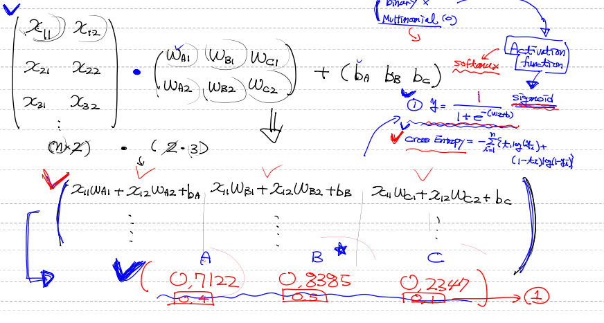

logistic regression을 통해 각각의 label에 대해서 구한 0~1사이의 값(sigmoid)을 softmax를 통해서 각각이 나올 확률(총합=1)을 구함

* BMI 예제

1. 데이터 전처리

   ```python
   import numpy as np
   import pandas as pd
   import matplotlib.pyplot as plt
   import tensorflow as tf
   from sklearn import linear_model
   from sklearn.preprocessing import MinMaxScaler
   from scipy import stats
   
   df = pd.read_csv('./bmi.csv')
   
   # Data Split ( Train Data와 Test Data로 나눌꺼예요! )
   x_data_train, x_data_test, t_data_train, t_data_test = train_test_split(df[['height', 'weight']],df['label'], test_size=0.3, random_state=0)  # random_state는 seed의 개념과 같아요!
   
   # Min-Max Scaler를 이용해서 정규화(Normalization)진행
   scaler = MinMaxScaler()
   scaler.fit(x_data_train)
   x_data_train_norm = scaler.transform(x_data_train)
   x_data_test_norm = scaler.transform(x_data_test)
   
   # One hot encoding
   sess = tf.Session()
   t_data_train_onehot = sess.run(tf.one_hot(t_data_train, depth=3))
   t_data_test_onehot = sess.run(tf.one_hot(t_data_test, depth=3))
   
   ```

   

2. logistic regression을 이용하여 모델 생성

   ```python
   # placeholder
   X = tf.placeholder(shape=[None,2], dtype=tf.float32)
   T = tf.placeholder(shape=[None,3], dtype=tf.float32)
   
   # Weight & bias
   W = tf.Variable(tf.random.normal([2,3]), name='weight')
   b = tf.Variable(tf.random.normal([3]), name='bias')
   
   # Hypothesis
   logit = tf.matmul(X,W) + b
   H = tf.nn.softmax(logit)   # Softmax Activation function 이용
   
   # loss
   loss = tf.reduce_mean(tf.nn.softmax_cross_entropy_with_logits_v2(logits=logit, labels=T))
   
   # train
   train = tf.train.GradientDescentOptimizer(learning_rate=1e-4).minimize(loss)
   
   # 초기화
   sess.run(tf.global_variables_initializer())
   
   # 학습용 함수
   def run_train(sess,train_x, train_t):
       print('### 학습 시작 ###')
       # 초기화
       sess.run(tf.global_variables_initializer())
       
       for step in range(num_of_epoch):
           total_batch = int(train_x.shape[0] / batch_size)
           
           for i in range(total_batch):
               batch_x = train_x[i*batch_size:(i+1)*batch_size]
               batch_t = train_t[i*batch_size:(i+1)*batch_size]           
               _, loss_val = sess.run([train,loss],
                                      feed_dict={X: batch_x,
                                                 T: batch_t})
               
           if step % 100 == 0:
               print('Loss : {}'.format(loss_val))
       print('### 학습 종료 ###')
       
   # Accuracy    
   predict = tf.argmax(H,1)
   correct = tf.equal(predict, tf.argmax(T,1))
   accuracy = tf.reduce_mean(tf.cast(correct, dtype=tf.float32))
   ```


3. 학습

   ```python
   # K-Fold Cross Validation
   cv = 5          # Fold의 수
   results = []    # 각 Fold당 학습과 성능평가가 진행되는데 
                   # 이때 계산된 성능평가 값을 저장
   kf = KFold(n_splits=cv, shuffle=True) 
   
   for training_idx, validation_idx in kf.split(x_data_train_norm):
       training_x = x_data_train_norm[training_idx] # Fancy indexing
       training_t = t_data_train_onehot[training_idx]
       
       val_x = x_data_train_norm[validation_idx]
       val_t = t_data_train_onehot[validation_idx]
       
       # 학습부터 시켜야 해요!
       run_train(sess,training_x,training_t)
       acc = sess.run(accuracy, feed_dict={X:val_x, T:val_t})
       print('측정한 각각의 결과값 : {}'.format(acc))
       results.append(acc)
   
   print('최종 K-Fold 교차검증을 사용한 Accuracy : {}'.format(np.mean(results)))
   ```


4. 평가

   ``` python
   from sklearn.metrics import confusion_matrix, classification_report
   
   ## Testing
   final_accuracy = sess.run(accuracy, feed_dict={X:x_data_test_norm,
                                                  T:t_data_test_onehot})
   print('우리 Model의 최종 정확도는 : {}'.format(final_accuracy))
   # 우리 Model의 최종 정확도는 : 0.9828333258628845
   
   ## classification_report
   target_names=['0', '1', '2']
   
   print(
   classification_report(t_data_test,
                        sess.run(predict, feed_dict={X:x_data_test_norm}),
                        target_names = target_names))
   
   #              precision    recall  f1-score   support
   
   #           0       0.99      0.99      0.99      1902
   #           1       0.97      0.97      0.97      1760
   #           2       0.99      0.99      0.99      2338
   
   #    accuracy                           0.98      6000
   #   macro avg       0.98      0.98      0.98      6000
   #weighted avg       0.98      0.98      0.98      6000
   
   
   ## confusion_matrix
   print(
   confusion_matrix(t_data_test,
                        sess.run(predict, feed_dict={X:x_data_test_norm})))
   
   # [[1880   22    0]
   #  [  26 1709   25]
   #  [   0   25 2313]]
   
   
   ```


* MNIST 손글씨 예제

1. 데이터 전처리

   ```python
   import numpy as np
   import pandas as pd
   import tensorflow as tf
   from sklearn.preprocessing import MinMaxScaler       # Normalization
   from sklearn.model_selection import train_test_split # train, test 분리
   from sklearn.model_selection import KFold            # Cross Validation
   
   train = pd.read_csv('./digital_train.csv')
   test = pd.read_csv('./digital_test.csv')
   
   train_label = train['label']
   train.drop(['label'], axis=1, inplace=True)
   
   ### 정규화
   scaler_train = MinMaxScaler()
   scaler_train.fit(train)
   norm_train_x = scaler_train.transform(train)
   
   scaler_test = MinMaxScaler()
   scaler_test.fit(train)
   norm_test_x = scaler_test.transform(test)
   
   ### tensorflow 기능을 이용해서 one hot encoding을 생성
   sess = tf.Session()
   onehot_train_label = sess.run(tf.one_hot(train_label, depth=10))
   
   ```

   

2. logistic regression을 이용하여 모델 생성

   ```python
   # placeholder
   X = tf.placeholder(shape=[None,784], dtype=tf.float32)
   T = tf.placeholder(shape=[None,10], dtype=tf.float32)
   
   # Weight & bias
   W = tf.Variable(tf.random.normal([784,10]), name='weight')
   b = tf.Variable(tf.random.normal([10]), name='bias')
   
   # Hypothesis
   logit = tf.matmul(X,W) + b
   H = tf.nn.softmax(logit)  # softmax activation function
   
   # loss function
   loss = tf.reduce_mean(tf.nn.softmax_cross_entropy_with_logits_v2(logits=logit,
                                                                    labels=T))
   # train
   train = tf.train.GradientDescentOptimizer(learning_rate=0.1).minimize(loss)
   
   # parameter
   num_of_epoch = 1000
   batch_size = 100
   
   # 학습용 함수
   def run_train(sess,train_x, train_t):
       print('### 학습 시작 ###')
       # 초기화
       sess.run(tf.global_variables_initializer())
       
       for step in range(num_of_epoch):
           total_batch = int(train_x.shape[0] / batch_size)
           
           for i in range(total_batch):
               batch_x = train_x[i*batch_size:(i+1)*batch_size]
               batch_t = train_t[i*batch_size:(i+1)*batch_size]           
               _, loss_val = sess.run([train,loss],
                                      feed_dict={X: batch_x, T: batch_t})
               
           if step % 500 == 0:
               print('Loss : {}'.format(loss_val))
       print('### 학습 종료 ###')
   
   ```

   

3. 학습

   ```python
   # Accuracy    
   predict = tf.argmax(H,1)
   correct = tf.equal(predict, tf.argmax(T,1))
   accuracy = tf.reduce_mean(tf.cast(correct, dtype=tf.float32))
   
   # K-Fold Cross Validation
   cv = 5          # Fold의 수
   results = []    # 각 Fold당 학습과 성능평가가 진행되는데 
                   # 이때 계산된 성능평가 값을 저장
   kf = KFold(n_splits=cv, shuffle=True) 
   
   for training_idx, validation_idx in kf.split(norm_train_x):
       training_x = norm_train_x[training_idx] # Fancy indexing
       training_t = onehot_train_label[training_idx]
       
       val_x = norm_train_x[validation_idx]
       val_t = onehot_train_label[validation_idx]
       
       # 학습부터 시켜야 해요!
       run_train(sess,training_x,training_t)
       acc = sess.run(accuracy, feed_dict={X:val_x, T:val_t})
       print('측정한 각각의 결과값 : {}'.format(acc))
       results.append(acc)
   
   print('최종 K-Fold 교차검증을 사용한 Accuracy : {}'.format(np.mean(results)))
   ```

   

4. 평가

   ```python
   # 공식을 이용해서 직접 img를 흑백처리
   
   from PIL import Image
   import matplotlib.pyplot as plt
   
   img = np.asarray(Image.open('8.png'))
   
   # 그레이 스케일링
   r = 0.2989
   g = 0.5870
   b = 0.1140
   gray = img[:, :, 0] * r + img[:, :, 1] * g + img[:, :, 2] * b
   img = Image.fromarray(gray)
   
   # 사이즈 조절
   img = img.resize((28,28))
   
   # 흑백 반전
   img = np.asarray(img)
   img = 255 - img 
   
   # 예측
   plt.imshow(img, cmap='Greys')
   plt.show()
   
   norm_img = scaler_test.transform(img.reshape(1,-1))
   
   result = sess.run(H, feed_dict={X: norm_img})
   
   for i in result:
       m = i.max()
       for j in range(10):
           if i[j] == m:
               print("예측 값 : {}".format(j))
               break
   ```

   

* Keras를 이용한 Logistic Regression Model 구축

  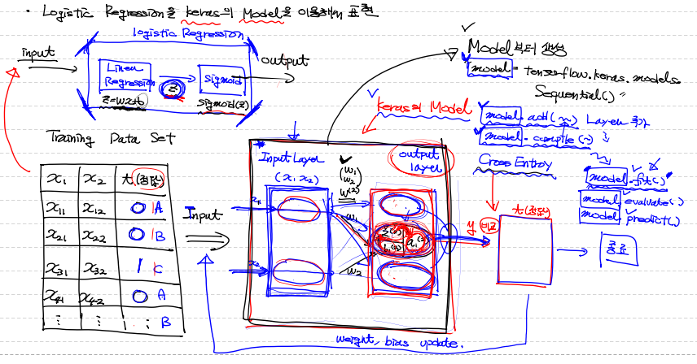

  ```python
  # Keras를 이용한 코드(Sample)
  import tensorflow as tf
  from tensorflow.keras.models import Sequential
  from tensorflow.keras.layers import Flatten, Dense
  from tensorflow.keras.optimizers import SGD, Adam
  
  model = Sequential()   # model 생성
  model.add(Flatten(input_shape=(1,)))
  model.add(Dense(1, activation='sigmoid' ))
  
  model.compile(optimizers=SGD(learning_rate=1e-3),
                loss='mse')
  
  model.fit(x_data_train,
            t_data_train,
            epochs=10,
            batch_size=200,
            validation_split=0.2)
  
  model.evaluate(x_data_test,t_data_test)
  model.predict(x_data_predict)
  
  model.save('./myModel.h5')
  model = tf.keras.models.load_model('./myModel.h5')
  ```


## KNN (K-Nearest Neighbor)

가장 가까운 훈련 데이터 포인트 k개를 최근접 이웃으로 찾아 예측에 사용하는 알고리즘

새로운 데이터가 들어왔을 때 기존 data들과의 거리를 계산해 이웃을 뽑아 예측을 수행

​	=> 딱히 학습이라는 절차가 필요 없다 => Instance-based learning, lazy model

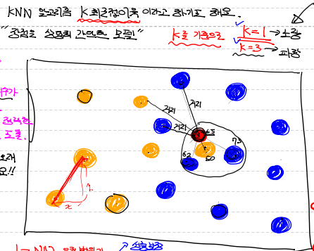

* KNN 의 장/단점

  장점 : 데이터 수가 많으면 상당히 정확한 결과를 도출

  단점 : 시간이 오래 걸린다

* Hyperparameter

  1. 이웃의 수(k)

     k가 작을 경우 => 지역적 특성을 너무 반영하는 overfitting

     k가 클 경우 => underfitting

  2. 거리 측정 방식

     Euclidean Distance, Manhattan Distance, Mahalanobis Distance

```python
import numpy as np
import pandas as pd
from sklearn.preprocessing import MinMaxScaler
from sklearn.model_selection import train_test_split
from sklearn.neighbors import KNeighborsClassifier

# Raw Data Loading
df = pd.read_csv('./bmi.csv', skiprows=3)

# data split
x_data_train, x_data_test, t_data_train, t_data_test = train_test_split(df[['height','weight']], df['label'],
                test_size=0.3,
                random_state=0)

# Normalization
scaler = MinMaxScaler()
scaler.fit(x_data_train)
x_data_train_norm = scaler.transform(x_data_train)
x_data_test_norm = scaler.transform(x_data_test)

# KNeighborsClassifier
knn_classifier = KNeighborsClassifier(n_neighbors=3)
knn_classifier.fit(x_data_train_norm,t_data_train)
print(knn_classifier.score(x_data_test_norm,t_data_test))   # 0.998
```


## SVM(Support Vector Machine)

주어진 데이터가 어느 그룹에 속하는지 분류하는 분류 모델로 두 부류 사이에 존재하는 여백을 의미하는 **마진(margin)**을 최대화하는 모델


여기서 마진이란 **분류선(Decision Boundary)**과 가장 가까운 데이터들과의 거리를 의미하고 이 분류선과 가장 가까운 데이터를 **서포트 벡터**라고 부른다

* KNN 의 장/단점

  장점 : 속도가 상당히 빠르다.

  단점 : 이상치에 민감하다.

* Hyperparameter

  1. C(Cost) 

     얼마나 많은 데이터 포인트가 다른 범위에 놓이는 것을 허용할지 정함

     기본값은 1로, C가 클수록 적게 허용

     C가 클수록 => 과대적합

     C가 작을수록 => 과소적합 

  2. Kernel

     단순 직선만으로 분류가 안되는 경우가 발생! => kernel과 gamma를 조정

     

     linear, poly(polynomial), rbf(가우시안)가 있고 기본값은 rbf

     poly : 2차원을 3차원으로 사상

     rbf : 상위차원에 데이터를 사상

  3. gamma

     poly와 rbf를 kernel로 사용할 경우 지정

     분류선을 얼마나 유연하게 그릴건지에 대한 정도

     gamma 클수록 => 분류선은 구불구불

     gamma 작을수록 => 분류선은 직선에 가깝게

