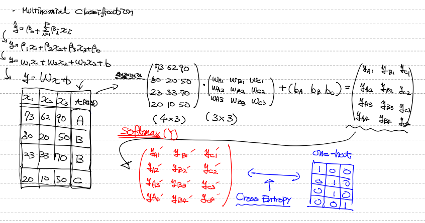
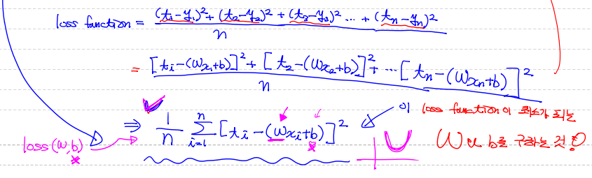

# AI 용어 정리

* AI(인공지능)

  인간이 가지는 특유의 학습, 추론 능력을 컴퓨터로 구현하려는 가장 포괄적인 개념

* Machine Learning

  AI를 구현하기 위한 하나의 방법. 데이터의 특성과 패턴을 학습 후, 미지의 데이터에 대한 추정치를 계산하는 프로그래밍 기법

* Deep Learning

  ML 중 Neural Network를 사용하는 기법

* Data Mining

  데이터의 상관관계를 분석하여 새로운 feature를 알아내는 방법


# Machine Learning

데이터를 학습해서 미지의 데이터에 대한 prediction

Explicit program(Rule based based programming)으로 해결할 수 없는 문제를 해결하기 위해 등장 => 경우의 수가 너무 많아 Rule 또한 너무 많아 해결 불가능( ex) 바둑 )

학습 방법에 따라 크게 4가지로 구분

* 지도학습(Supervised Learning) => Data Set에 Label 유 

  ​															우리가 해결하는 거의 대부분의 문제

  1. Regression

     훈련 데이터 셋을 이용해 학습하고 나온 predict model이 연속적인 값을 예측(얼마나??)

     

  2. Binary Classification

     predict model이 어떤 부류에 속하는지를 예측(어떤 것??)

     

  3. Multinomial Classification

     

* 비지도학습(Unsupervised Learning) => Data Set에 Label 무 

* 준지도학습(Semi-supervised Learning) =>  Data Set에 Label 유무가 혼재 

* 강화학습(Reinforcement Learning) => 별개의 방법


## 수치 미분(Numerical Differentation)

프로그램적으로 계산을 통해 [미분](함수에 대해 특정 순간의 변화량)을 수행(약간의 오차 발생)

보통 중앙차분을 이용


편미분 : 입력변수(독립변수)가 2개 이상인 다변수 함수에서 미분하고자하는 변수를 제외한 나머			   지 변수들을 상수처리해서 미분을 진행

* 일변수 함수에 대한 수치 미분

  ```python
  # 입력으로 들어오는 x에서 아주 미세하게 변화할때
  # 함수 f가 얼마나 변하는지에 대해 수치적으로 계산해보아요!
  
  # 아래의 함수는 인자를 2개 받아요.
  # 한개는 미분하려는 함수, 특정 점에서 미분값을 구하기 위한 x값.
  def numerical_derivative(f,x):
      
      # f : 미분하려는 함수
      # x : 미분값을 알고자하는 입력값.
      # delta_x => 극한에 해당하는 값으로 아주 작은값을 이용.
      #            1e-8이하로 지정하면 소수점 연산 오류가 발생.
      #            일반적으로 1e-5정도로 설정하면 되요
      delta_x = 1e-5
      
      return (f(x+delta_x) - f(x-delta_x)) / (2 * delta_x) # 중앙 차분
      
      
  # 미분하려는 함수가 있어야 해요! (일변수 함수)
  def my_func(x):
      
      return x ** 2     # f(x) = x^2
  
  result = numerical_derivative(my_func,3)
  
  print('미분한 결과값은 : {}'.format(result))  # 6.000000000039306
  ```

* 다변수 함수에 대한 수치 미분

  ```python
  ### 일반적으로 다변수 함수의 수치미분 코드를 이용합니다.
  
  # 입력변수가 2개 이상인 다변수 함수인 경우
  # 입력변수는 서로 독립이기 때문에 수치미분 역시 변수의 개수만큼 개별적으로
  # 진행해야 해요!
  
  import numpy as np
  
  def numerical_derivative(f,x):
      
      # f : 미분하려고 하는 다변수 함수
      # x : 모든 값을 포함하는 numpy array  ex) f'(1.0, 2.0) = (8.0, 15.0)
      delta_x = 1e-4
      derivative_x = np.zeros_like(x)    # [0 0]
      
      it = np.nditer(x, flags=['multi_index'])
      
      while not it.finished:
          
          idx = it.multi_index   # 현재의 iterator의 index를 추출 => tuple형태로 나와요     
          
          tmp = x[idx]     # 현재 index의 값을 잠시 보존.
                           # delta_x를 이용한 값으로 ndarray를 수정한 후 편미분을 계산
                           # 함수값을 계산한 후 원상복구를 해 줘야 다음 독립변수에
                           # 대한 편미분을 정상적으로 수행할 수 있어요!   
          x[idx] = tmp + delta_x        
          fx_plus_delta = f(x)    # f([1.00001, 2.0])   => f(x + delta_x)
          
  
          x[idx] = tmp - delta_x
          fx_minus_delta = f(x)    # f([0.99999, 2.0])   => f(x - delta_x)
          
          derivative_x[idx] = (fx_plus_delta - fx_minus_delta) / (2 * delta_x)
          
          x[idx] = tmp
          
          it.iternext()
          
      return derivative_x
  
  
  def my_func(input_data):
      
      x = input_data[0]
      y = input_data[1]
      return 2*x + 3*x*y + np.power(y,3)     # f(x) = 2x + 3xy + y^3
  
  
  param = np.array([1.0,2.0])
  result = numerical_derivative(my_func,param)
  print('미분한 결과는 : {}'.format(result)) # [8, 15.0000001]
  ```

  

## Regression

Regression Model(회귀 모델)은 어떠한 데이터에 대해서 그 값에 영향을 주는 조건을 고려하여 데이터의 평균을 구하기 위한 함수. 즉, 그 데이터를 가장 잘 표현하는 함수.

* Model을 만드는 이유?

  우리가 해결해야 하는 현실은 너무 복잡 => 단순화. 따라서, 가정이 필요

  * 오차항은 정규분포를 따른다.

  * 독립변수와 종속변수가 선형관계

  * 데이터에 이상치가 없다.

  * 독립변수와 오차항은 독립 등등

    

* Classical Linear Regression Model

  

  * MSE

    

    

  * 손실 함수(Loss Function) = 비용 함수(Cost Function)

    훈련 데이터 셋의 정답 t와 입력 x에 대한 y(모델의 예측값)의 차이를 모두 더해 수식으로 나타낸 식 => MSE를 이용

    최소제곱법을 이용해서 loss function을 만들고 그 값이 최소가 되게 하는 w와 b를 학습 과정을 통해 찾는다.

    

    

  * 경사하강법(Gradient Descent Algorithm)

    loss function의 값이 최소가 되게 하는 w를 찾기 위한 방법으로,  loss function의 미분값이 0이 되는 w를 찾기 위해 w를 조금씩 줄여가면서 찾는다.

    

    여기서, epoch와 learning late를 통해 접근을 조절

    

  ```python
  # 1. Training Data Set 준비 : ndarray를 이용해서 데이터셋을 사용할꺼예요!
  # 2. Linear Regression Model을 정의 : 
  #    - Weight와 bias를 정의하고 이를 이용해서 Hypothesis(Model)을 정의해요!
  # 3. Loss function 정의 : 손실함수(Loss function)을 코드로 표현
  # 4. learning rate를 정의 : 일반적으로 customizing해야 하는 값으로
  #                           1e-3정도로 설정해서 사용.
  # 5. 학습을 진행 : 반복적으로 편미분을 이용해서 W와 b의 값을 update처리
  
  
  # Tensorflow를 이용해서 배운 이론을 실제로 구현해 보아요!
  # Tensorflow는 Google이 만든 Deep Library
  # Tensorflow는 1.x버전과 2.x버전으로 나뉘어져요!
  # 2019년 10월 Tensorflow 2.x버전이 정식으로 release
  # 1.x버전은 low level의 코딩이 필요!
  # 2.x버전은 상위 API(Keras)가 기본으로 포함. => 구현이 쉬워요!
  # 사용하기 위해서 라이브러리부터 설치를 해야 하겠죠!!
  
  import tensorflow as tf
  print(tf.__version__) # 1.15.0
  
  node1 = tf.constant('Hello World')
  
  # 그래프를 실행하려면 1.x버전에서는 session이 필요
  # 1.x버전에서만 사용되요. 2.x버전에서는 삭제
  # session은 그래프안의 특정 노드를 실행시킬 수 있어요!
  sess = tf.Session()
  
  print(sess.run(node1).decode()) # Hello World
  
  print(node1)  # Tensor("Const:0", shape=(), dtype=string)
  
  node1 = tf.constant(10, dtype=tf.float32)
  node2 = tf.constant(30, dtype=tf.float32)
  
  node3 = node1 + node2
  
  print(sess.run([node3, node1])) # [40.0, 10.0]
  ```

  

