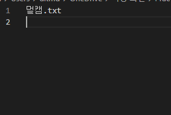
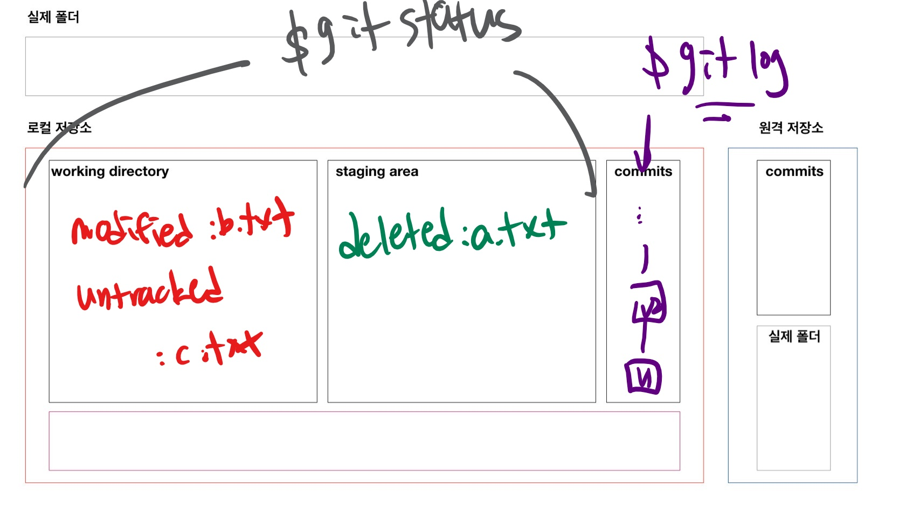

# git 기초 명령어

* 분산버전관리시스템(DVCS)

## 0. 로컬 저장소(repository) 설정

```bash
# 초기화
$ git init
Reinitialized existing Git repository in C:/Users/dltmd/OneDrive/바탕 화면/Prac/.git/

$ git branch -M main
```

* `.git` 폴더가 생성되고, 여기에 모든 git과 관련된 정보들이 저장

## 1. add

```bash
$ touch a.txt
$ git status
On branch master
Untracked files:
  (use "git add <file>..." to include in what will be committed)
        "Markdown \353\254\270\353\262\225 \352\270\260\354\264\210.md"
        "git \352\270\260\354\264\210.md"
        md-images/

nothing added to commit but untracked files present (use "git add" to track)

$ git add .
$ git status
On branch master
# 커밋이 변결될 사항
Changes to be committed:
  (use "git restore --staged <file>..." to unstage)
        new file:   "Markdown \353\254\270\353\262\225 \352\270\260\354\264\210.md"
        new file:   "git \352\270\260\354\264\210.md"
        new file:   md-images/md-images.PNG
```

## 2. commit

```bash
$ git commit -m 'Third commit'
[master bbe02e6] Third commit
 3 files changed, 84 insertions(+)
 create mode 100644 "Markdown \353\254\270\353\262\225 \352\270\260\354\264\210.md"
 create mode 100644 "git \352\270\260\354\264\210.md"
 create mode 100644 md-images/md-images.PNG
```

* `commit`은 지금 상태를 스냅샷을 찍는다.
* 커밋 메세지는 지금 기록하는 이력을 충분히 잘 나타낼 수 있도록 작성
* `git log` 명령어를 통해 지금까지 기록된 커밋들을 확인 가능

## 3. log

> 커밋 히스토리

``` bash
$ git log
commit bbe02e60725d5a50d061eebdb13292e921a7e4e7 (HEAD -> master)
Author: dltmdgh1994 <dltmdgh1997@gmail.com>
Date:   Tue Dec 29 14:11:12 2020 +0900

    Third commit

commit d4b1e68539ceb5a8558c82bb868c61708d6b096f
Author: dltmdgh1994 <dltmdgh1997@gmail.com>
Date:   Tue Dec 29 11:43:28 2020 +0900

    Second commit!!!

commit 72a427a2dba31da3cf26766497e70dca5aff9cda
Author: dltmdgh1994 <dltmdgh1997@gmail.com>
Date:   Tue Dec 29 11:27:13 2020 +0900

    First commit!!!

$ git log --oneline
bbe02e6 (HEAD -> master) Third commit
d4b1e68 Second commit!!!
72a427a First commit!!!

$ git log -2
commit bbe02e60725d5a50d061eebdb13292e921a7e4e7 (HEAD -> master)
Author: dltmdgh1994 <dltmdgh1997@gmail.com>
Date:   Tue Dec 29 14:11:12 2020 +0900

    Third commit

commit d4b1e68539ceb5a8558c82bb868c61708d6b096f
Author: dltmdgh1994 <dltmdgh1997@gmail.com>
Date:   Tue Dec 29 11:43:28 2020 +0900

    Second commit!!!

$ git log --oneline -1
bbe02e6 (HEAD -> master) Third commit
```


## 4. git commit author 설정

git commit --global user.name "dltmdgh1994"

git commit --global user.email "dltmdgh1997@gmail.com"

``` bash
$ git config --global user.name
dltmdgh1994
```


## 5. 원격 저장소(remote repository) 활용 기초

> 다양한 원격저장소 서비스 중 Github를 기준

* 원격저장소 설정

  ``` bash
  $git remote add origin __url__
  ```

* push

  ```bash
  $git push -u origin master
  ```

* 설정된 원격저장소를 확인

  ```bash
  $ git remote -v
  origin  https://github.com/dltmdgh1994/multicampus.git (fetch)
  origin  https://github.com/dltmdgh1994/multicampus.git (push)
  ```

* 원격저장소 수정

  ```bash
  $ git remote set-url origin https://github.com/dltmdgh1994/multicampus.git
  ```

## 6. git ignore

```bash
## gitignore를 생성
$ touch .gitignore
```

* 내부에 commit하고 싶지 않은 것들의 목록 작성



## 7. git clone

원격 저장소를 복제하여 로컬에서 활용

```bash
$ git clone url
```

* 원격 저장소 이름의 폴더가 생성되고, 해당 폴더로 이동하면 git을 활용할 수 있다.
* 단순히 zip으로 받으면 .git은 포함되지 않기 때문에 commit 기록이 남지 않는다.
* 즉, zip 다운로드 = git init

## 8. push & pull 

```bash
$ git push origin branch명
```

```bash
$ git pull origin branch명
```

## 9. Branch

명령어

1. 브랜치 생성

   ```bash
   $ git branch 이름
   ```

2. 브랜치 이동

   ```bash
   $ git checkout 이름
   ```

3. 브랜치 생성 및 이동

   ```bash
   $ git checkout -b 이름
   ```

4. 브랜치 목록

   ```bash
   $ git branch
   ```

5. 브랜치 병합

   ```bash
   (master) $ git merge 이름
   ```

   * master 브랜치에 대상 브랜치를 병합

6. 브랜치 삭제

   ```bash
   $ git branch -d 이름
   ```


### 상황 1. fast-foward(프리라이딩)

> fast-foward는 feature 브랜치 생성된 이후 master 브랜치에 변경 사항이 없는 상황

1. feature/test branch 생성 및 이동

   ```bash
   $ git branch feature/test
   $ git branch
     feature/test
   * master
   $ git checkout feature/test
   Switched to branch 'feature/test'
   (feature/test) $
   ```

2. 작업 완료 후 commit

   ```bash
   $ touch test.txt
   $ git add .
   $ git commit -m 'Complete test'
   [feature/test 5ff4709] Complete test
    1 file changed, 0 insertions(+), 0 deletions(-)
    create mode 100644 test.txt
   $ git log --oneline
   # feature/test 브랜치 + HEAD
   5ff4709 (HEAD -> feature/test) Complete test
   # master 브랜치
   c6f5db0 (master) Add README
   ```


3. master 이동

   ```bash
   $ git checkout master
   Switched to branch 'master'
   (master) $
   ```


4. master에 병합

   ```bash
   $ git log --oneline
   c6f5db0 (HEAD -> master) Add README
   $ git merge feature/test
   Updating c6f5db0..5ff4709
   # Fast-forward!!!!
   # MASTER에 변경사항 없어서 그냥 앞으로 
   Fast-forward
    test.txt | 0
    1 file changed, 0 insertions(+), 0 deletions(-)
    create mode 100644 test.txt
   ```


5. 결과 -> fast-foward (단순히 HEAD를 이동)

   ```bash
   $ git log --oneline
   5ff4709 (HEAD -> master, feature/test) Complete test
   c6f5db0 Add README
   ```

6. branch 삭제

   ```bash
   $ git branch -d feature/test
   Deleted branch feature/test (was 5ff4709).
   ```

---

### 상황 2. merge commit(보고서/PPT 각자)

> 서로 다른 이력(commit)을 병합(merge)하는 과정에서 다른 파일이 수정되어 있는 상황
>
> git이 auto merging을 진행하고, commit이 발생된다.

1. feature/data branch 생성 및 이동

   ```bash
   $ git checkout -b feature/data
   Switched to a new branch 'feature/data'
   ```

2. 작업 완료 후 commit

   ```bash
   $ touch data.txt
   $ git add .
   $ git commit -m 'Complete data'
   [feature/data 6b0245e] Complete data
    1 file changed, 0 insertions(+), 0 deletions(-)
    create mode 100644 data.txt
   $ git log --oneline
   6b0245e (HEAD -> feature/data) Complete data
   5ff4709 (master) Complete test
   c6f5db0 Add README
   ```

3. master 이동

   ```bash
   $ git checkout master
   ```

4. *master에 추가 commit 이 발생시키기!!*

   * **다른 파일을 수정 혹은 생성하세요!**

     ```bash
     $ touch hotfix.txt
     $ git add .
     $ git commit -m 'hotfix'
     $ git log --oneline
     6930e34 (HEAD -> master) hotfix
     5ff4709 Complete test
     c6f5db0 Add README
     ```

5. master에 병합

   ```bash
   $ git merge feature/data
   Merge made by the 'recursive' strategy.
    data.txt | 0
    1 file changed, 0 insertions(+), 0 deletions(-)
    create mode 100644 data.txt
   ```

6. 결과 -> 자동으로 *merge commit 발생*

   * vim 편집기 화면이 나타납니다.

   * 자동으로 작성된 커밋 메시지를 확인하고, `esc`를 누른 후 `:wq`를 입력하여 저장 및 종료를 합니다.
      * `w` : write
      * `q` : quit
      
   * 커밋을  확인 해봅시다.

      ```bash
      44515f8 (HEAD -> master) Merge branch 'feature/data'
      6930e34 hotfix
      6b0245e (feature/data) Complete data
      5ff4709 Complete test
      c6f5db0 Add README
      ```

7. 그래프 확인하기

   ```bash
   $ git log --oneline --graph
   *   44515f8 (HEAD -> master) Merge branch 'feature/data'
   |\
   | * 6b0245e (feature/data) Complete data
   * | 6930e34 hotfix
   |/
   * 5ff4709 Complete test
   * c6f5db0 Add README
   ```

8. branch 삭제

   ```bash
   $ git branch -d feature/data
   Deleted branch feature/data (was 6b0245e).
   ```
   
   

---

### 상황 3. merge commit 충돌(보고서/PPT 같이)

> 서로 다른 이력(commit)을 병합(merge)하는 과정에서 동일 파일이 수정되어 있는 상황
>
> git이 auto merging을 하지 못하고, 해당 파일의 위치에 라벨링을 해준다.
>
> 원하는 형태의 코드로 직접 수정을 하고 merge commit을 발생 시켜야 한다.

1. feature/web branch 생성 및 이동

   ```bash
   $ git checkout -b feature/web
   ```

2. 작업 완료 후 commit

   ```bash
   # README.md 파일 수정!!!
   $ touch README.md
   $ git status
   On branch feature/web
   Changes not staged for commit:
     (use "git add <file>..." to update what will be committed)
     (use "git restore <file>..." to discard changes in working directory)
           modified:   README.md
   
   Untracked files:
     (use "git add <file>..." to include in what will be committed)
           web.txt
   
   no changes added to commit (use "git add" and/or "git commit -a")
   $ git add .
   $ git commit -m 'Update and Complete'
   ```


3. master 이동

   ```bash
   $ git checkout master
   ```


4. *master에 추가 commit 이 발생시키기!!*

   * **동일 파일을 수정 혹은 생성하세요!**

   ```bash
   # README 파일을 수정
   $ git status
   On branch master
   Changes not staged for commit:
     (use "git add <file>..." to update what will be committed)
     (use "git restore <file>..." to discard changes in working directory)
           modified:   README.md
   
   no changes added to commit (use "git add" and/or "git commit -a")
   $ git add .
   $ git commit -m 'Update README'
   ```

5. master에 병합

   ```bash
   $ git merge feature/web
   # 자동으로 병합하는 중에..
   Auto-merging README.md
   # 충돌발생(Merge conflict)
   CONFLICT (content): Merge conflict in README.md
   # 자동 머지 실패함; 
   # 충돌을 고치고 결과를 커밋해.
   Automatic merge failed; fix conflicts and then commit the result.
   (master|MERGING) $
   ```


6. 결과 -> *merge conflict발생*

   ```bash
   $ git status
   On branch master
   You have unmerged paths.
     (fix conflicts and run "git commit")
     (use "git merge --abort" to abort the merge)
   
   Changes to be committed:
           new file:   web.txt
   # 어디서 충돌이 난건지 확인..
   Unmerged paths:
     (use "git add <file>..." to mark resolution)
           both modified:   README.md
   
   ```


7. 충돌 확인 및 해결

   ```
   <<<<<<< HEAD
   # Project
   
   * data 프로젝트 blah blah
   =======
   # 프로젝트
   
   * web 개발
   >>>>>>> feature/web
   ```


8. merge commit 진행

    ```bash
    $ git commit
    ```

   * vim 편집기 화면이 나타납니다.
   
   * 자동으로 작성된 커밋 메시지를 확인하고, `esc`를 누른 후 `:wq`를 입력하여 저장 및 종료를 합니다.
      * `w` : write
      * `q` : quit
      
   * 커밋이  확인 해봅시다.
   
9. 그래프 확인하기

    ```bash
   $ git log --oneline --graph
   *   1a08480 (HEAD -> master) Merge branch 'feature/web'
   |\
   | * 156b027 (feature/web) Update README and Complete web
   * | 30c71d2 Update README
   |/
   *   44515f8 Merge branch 'feature/data'
   |\
   | * 6b0245e Complete data
   * | 6930e34 hotfix
   |/
   * 5ff4709 Complete test
   * c6f5db0 Add README
   ```


10. branch 삭제

    
    
    
    
    ### 정리


## 10. status

```bash
$ git status
On branch master
# 커밋될 변경사항들..
# SA O
Changes to be committed:
  (use "git restore --staged <file>..." to unstage)
  # a.txt 삭제된...
        deleted:    a.txt

# 변경사항인데 Staging 아닌것
# WD O
Changes not staged for commit:
  (use "git add <file>..." to update what will be committed)
  (use "git restore <file>..." to discard changes in working directory)
  # b.txt가 수정된...
        modified:   b.txt
# Untrack 
# WD O
Untracked files:
  (use "git add <file>..." to include in what will be committed)
  # 새로운 파일..
        c.txt

```

* git 저장소 내의 변경사항을 추적
  * `untracked`
    * 한번도 git으로 관리한 적 X
    * 파일생성 등
  * `tracked` 
    * `modified`
      * `modified` : 수정
      * `deleted` : 삭제
    * `unmodified` : git status에 등장하지 않음





## 11. Undoing

### add 취소

```bash
$ git add .
$ git status
On branch master
Changes to be committed:
# staging area에서 내리기 위해서는..
  (use "git restore --staged <file>..." to unstage)
        new file:   1.txt
```

```bash
$ git restore --staged 1.txt
$ git status
On branch master
Untracked files:
  (use "git add <file>..." to include in what will be committed)
        1.txt

nothing added to commit but untracked files present (use "git add" to track)

```

### WD 작업내용 취소

> 주의! 커밋되지 않은 변경사항을 없애는 것으로 명령어를 실행한 이후 다시 돌이킬 수 없다.

```bash
$ git status
On branch master
Changes not staged for commit:
  (use "git add <file>..." to update what will be committed)
  # 변경사항을 버리기 위해서는..
  # WD 있는..
  (use "git restore <file>..." to discard changes in working directory)
        modified:   d.txt

no changes added to commit (use "git add" and/or "git commit -a")

```

* 해결

  ```bash
  $ git restore d.txt
  $ git status
  On branch master
  nothing to commit, working tree clean
  ```

### Commit 메시지 변경

> 주의! 공개된 저장소에 이미 push가 된 경우 절대 변경을 하지 않는다.

```bash
$ touch f.txt
$ git add .
$ git commit -m 'Add d.txt'
```

```bash
$ git log --oneline
5f5ac68 (HEAD -> master) Add d.txt
d81c176 작업끝
57ad4ef Status
fb4ad8d Add b.txt
ec0574d Add a.txt
$ git commit --amend
# vim 편집기로 수정하고 저장 (esc, :wq)
$ git log --oneline
# 커밋 해시값 변화!
0c330b4 (HEAD -> master) Add f.txt
d81c176 작업끝
57ad4ef Status
fb4ad8d Add b.txt
ec0574d Add a.txt
```

## 12. reset vs revert

### reset

* `--hard` : 모든 작업(변경사항) 내용과 이력을 삭제 (조심!!!)
* `--mixed` : 모든 변경사항을 SA에 보관
* `--soft` : WD 있는 내용까지도 보관

```bash
$ git log --oneline
0c330b4 (HEAD -> master) Add f.txt
d81c176 작업끝
57ad4ef Status
fb4ad8d Add b.txt
ec0574d Add a.txt

$ git reset --hard d81c176
HEAD is now at d81c176 작업끝

$ git log --oneline
d81c176 (HEAD -> master) 작업끝
57ad4ef Status
fb4ad8d Add b.txt
ec0574d Add a.txt


// [방법 1] commit을 취소하고 해당 파일들은 staged 상태로 워킹 디렉터리에 보존
$ git reset --soft HEAD^
// [방법 2] commit을 취소하고 해당 파일들은 unstaged 상태로 워킹 디렉터리에 보존
$ git reset --mixed HEAD^ // 기본 옵션
$ git reset HEAD^ // 위와 동일
$ git reset HEAD~2 // 마지막 2개의 commit을 취소
// [방법 3] commit을 취소하고 해당 파일들은 unstaged 상태로 워킹 디렉터리에서 삭제
$ git reset --hard HEAD^
```

### revert 

```bash
$ git log --oneline
0c330b4 (HEAD -> master) Add f.txt
d81c176 작업끝
57ad4ef Status
fb4ad8d Add b.txt
ec0574d Add a.txt

$ git revert 0c330b4
Removing f.txt
[master 56ff1b7] Revert "Add f.txt"
 1 file changed, 0 insertions(+), 0 deletions(-)
 delete mode 100644 f.txt

$ git log --oneline
56ff1b7 (HEAD -> master) Revert "Add f.txt"
0c330b4 Add f.txt
d81c176 작업끝
57ad4ef Status
fb4ad8d Add b.txt
ec0574d Add a.txt

```


## 13. clean

Untracked한 파일들을 지운다.

``` bash
$ git clean -f // 디렉터리를 제외한 파일들만 삭제
$ git clean -f -d // 디렉터리까지 삭제
$ git clean -f -d -x // 무시된 파일까지 삭제
```

