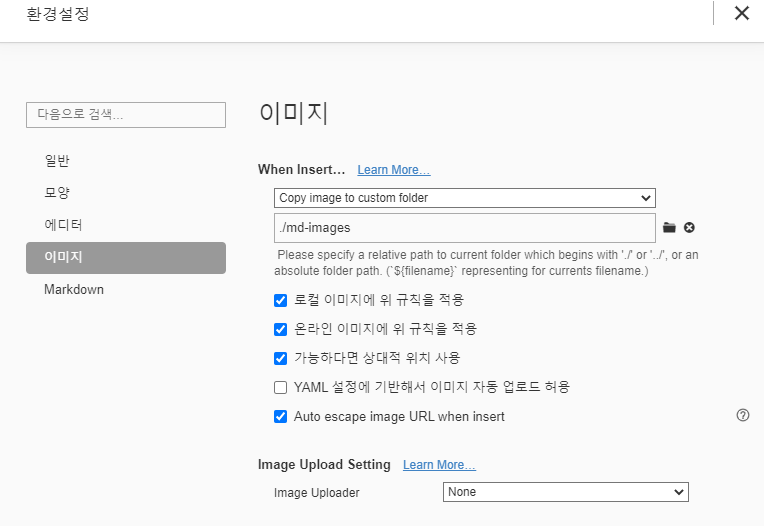

# Markdown 문법 기초

## 제목(heading)

### 제목3

#### 제목4

## 목록

1. 순서가 있는 목록 엔터
2. 순서가 있는 목록
   1. tab을 누르면 하위 레벨에서 작성
   2. 하위 레벨
3. shift+tab을 누르면 상위 레벨로 올라옴

* 순서가 없는 목록
* *띄어쓰기를 통해 동그라미 생성
  * tab을 누르면 하위 레벨에서 작성
* shift+tab을 누르면 상위 레벨로 올라옴

## [코드블록](```python ~ ```)

```python
print('hi')
```

## 링크

[구글!](https://google.com)

## [각주]([^1])

구글[^1]

[^1]: https://google.com

 ## 그림



* typora 설정을 통해 상대 경로로 이미지를 관리해야 github 등에서 이미지가 깨지지 않고 활용 가능

## 기타

[*기울임*](*기울임*)          `*기울임*`

[**굵게**](**굵게**)

[~~취소선~~](~~취소선~~)

---

* ---띄어쓰기로 표현

> [인용문](>)
>
> 인용문

## 주석

`을 통해 열고 닫는다.


