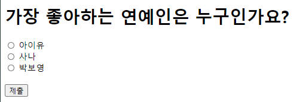

# 1. 프로젝트 및 애플리케이션 생성

```bash
# 프로젝트 생성
django-admain startproject mysite

# polls라는 애플리케이션 생성(투표기능)
# manage.py가 있는 곳으로 cd한 후
python manage.py startapp polls
```


# 2. Settings.py 변경

```bash
# 1. ALLOWED_HOSTS 지정(서버의 IP나 도메인을 지정)
ALLOWED_HOSTS = ['localhost', '127.0.0.1']

# 2. INSTALLED_APPS 에 'polls.apps.PollsConfig' 추가

# 3. 사용할 DB 엔진 설정 (default : SQLite3)

# 4. 타임존 지정
TIME_ZONE = 'Asia/Seoul'
```


# 3. migrate 및 runserver

```bash
# 파이참 터미널에서 명령어 수행
# default db 생성 (migrate는 DB에 변경사항이 있을 경우 이를 반영해주는 명령어)
python manage.py migrate

# 서버 가동
python manage.py runserver
# 서버 가동 후 http://localhost:8000/로 접속
# 관리자 페이지 : http://localhost:8000/admin

#서버 종료
#컨트롤+c 입력

# 관리자 페이지 로그인을 위해 슈퍼계정 생성
# 대상 프로젝트 폴더로 cd한 후
python manage.py createsuperuser
```


# 4. 애플리케이션 개발


## 1. Model 코딩

1. 테이블 정의 (polls 애플리케이션은 Question과 Choice 2개의 테이블이 필요)

   ```python
   # models.py에 구현
   from django.db import models
   
   
   # Create your models here.
   class Question(models.Model):
       # 이렇게 정의되는 class가 DB의 Table과 mapping
       # Table의 column를 속성으로 표현
       question_text = models.CharField(max_length=200)
       pub_date = models.DateTimeField('date published')
   
       def __str__(self):
           return self.question_text
   
   
   class Choice(models.Model):
       choice_text = models.CharField(max_length=200)
       votes = models.IntegerField(default=0)
       question = models.ForeignKey(Question, on_delete=models.CASCADE)
   
       def __str__(self):
           return self.choice_text
   ```

   

2. Admin에 테이블 반영

   ```bash
   # admin.py에 구현
   from django.contrib import admin
   from polls.models import Question, Choice
   
   
   # Register your models here.
   admin.site.register(Question)
   admin.site.register(Choice)
   ```


3. DB 변경사항 반영

   ```bash
   # 파이참 터미널에서 명령어 수행
   python manage.py makemigrations
   python manage.py migrate
   ```


## 2. View 및 Templete 코딩


1. urls.py 설정

   전체 프로젝트와 애플리이션에 따로 2개의 urls.py 구현

   * mysite/urls.py

   ```python
   from django.contrib import admin
   from django.urls import path, include
   from polls import views
   
   urlpatterns = [
       path('admin/', admin.site.urls),
   
       # path('polls/', views.index, name='index')
       # 애플리케이션 단위로 관리하기 위해 include 사용
       path('polls/', include('polls.urls'))
   ]
   ```
   

   * mysite/polls/urls.py

   ```python
   from django.urls import path, include
   from . import views
   
   # index 변수를 공유하기 때문에 namespace를 지정
   app_name = 'polls'
   
   urlpatterns = [
       path('', views.index, name='index'),
       # 변하는 값을 넣기 위해 <int:>를 사용
       path('<int:question_id>/', views.detail, name='detail'),    # polls:detail
       path('<int:question_id>/vote/', views.vote, name='vote'),   # polls:vote
       path('<int:question_id>/results/', views.results, name='results')   # polls:results
   ]
   ```


2. views.py 구현

   각 화면에서 작동할 함수를 구현

   ```python
   from django.shortcuts import render, get_object_or_404
   from polls.models import Question, Choice
   from django.http import HttpResponseRedirect
   from django.urls import reverse
   
   
   # DB에서 설문목록을 가져옴
   def index(request):
       # 오름차순
       # 내림차순은 '-pub_date'
       question_list = Question.objects.all().order_by('pub_date')[:5]
   
       # 데이터 전달용 dic
       context = {'q_list': question_list}
   
       return render(request, 'polls/index.html', context)
   
   
   # 숫자가 question_id로, question_id는 설문에 대한 PK
   # 투표에 진입 후 선택지를 가져옴
   def detail(request, question_id):
       # object를 불러오고, 실패하면 404페이지 띄움
       question = get_object_or_404(Question, pk=question_id)
   
       context = {'selected_question': question}
   
       return render(request, 'polls/detail.html', context)
   
   
   # 투표한 경우 DB 내 표 수를 변경
   def vote(request, question_id):
       question = get_object_or_404(Question, pk=question_id)
       try:
           selected_choice = question.choice_set.get(pk=request.POST['my_choice'])
       except(KeyError, Choice.DoesNotExist):
           # 선택지를 선택하지 않아서 오류가 발생하는 경우
           return render(request, 'polls/detail.html',
                         {'selected_question': question,
                          'error_message': 'Select Something!'})
       else:
           selected_choice.votes += 1
           selected_choice.save()
   
           # reverse() => urls.py(URLConf)에 있는 name을 이용해서 url형식으로 반환
           return HttpResponseRedirect(reverse('polls:results',
                                               # 튜플을 표현하기 위해 요소 한개는 ,를 추가
                                               args=(question.id,)))
   
   
   # 투표 결과를 보여줌
   def results(request, question_id):
       question = get_object_or_404(Question, pk=question_id)
       return render(request, 'polls/results.html', {'question': question})
   ```


3. templates 디렉토리를 생성 후 내부에 각 화면을 표현할 html 생성

   * index.html

   ```html
   <!DOCTYPE html>
   <html lang="en">
   <head>
       <meta charset="UTF-8">
       <title>Title</title>
   </head>
   <body>
       
           <ul>
               
                       <li><a href="/polls/{{ question.id }}">{{ question.question_text }}</a></li>
               
           </ul>
       
           <h1>No data!</h1>
       
   </body>
   </html>
   ```

   

   

   * detail.html

   ```python
   <!DOCTYPE html>
   <html lang="en">
   <head>
       <meta charset="UTF-8">
       <title>Title</title>
   </head>
   <body>
       <h1>{{ selected_question.question_text }}</h1>
   
       <!-- 에러가 발생한 경우 호출 -->
       
       <div>{{ error_message }}</div>
       
   
       <!-- url : http://localhost:8000/polls/{ selected_question }}/vote/ 와 동일-->
       <form action="" method="POST">
           <!-- form 사용 시 보안을 위해 사용, 안 쓰면 에러! -->
           
           
           <input type="radio" name="my_choice"
                  id="btn{{ forloop.counter }}" value="{{ choice.id }}">
           <label for="btn{{ forloop.counter }}">{{ choice.choice_text }}</label><br>
           
           <br>
           <input type="submit" name="제출">
       </form>
   </body>
   </html>
   ```

   

   

   * results.html

   ```html
   <!DOCTYPE html>
   <html lang="en">
   <head>
       <meta charset="UTF-8">
       <title>Title</title>
   </head>
   <body>
       <h1>{{ question.question_text }}</h1>
       <ul>
           
               <li>{{ choice.choice_text }} - {{ choice.votes }}</li>
           
       </ul>
       <a href="">다시 투표하기</a>
   </body>
   </html>
   ```

   

